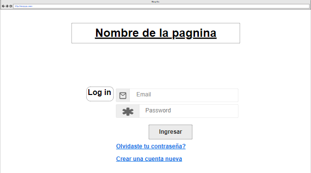

# Nombre de la pagina: NO SE

## Integrantes

- Dalle Nogare Pierluigi (PierElCapo) - 7mo 1ra AVC - COM C 
- De Godoy Maximo (Dishi001) - 7mo 1ra AVC - COM C 

## Objetivo 

Diseñar y programar una pagina que sea capaz de generar un mapa. Habra diferentes plantillas en las cuales se le podran colocar imagenes chicas encima y asi generar un mapa.

## Paginas

### Pagina

### Sub-pagina

